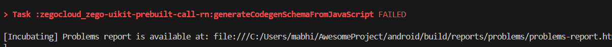
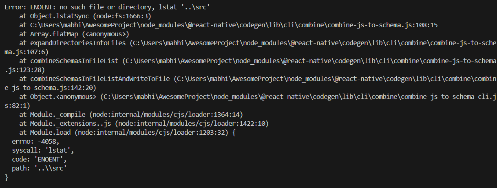
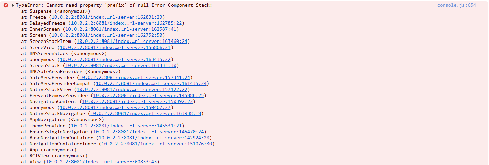
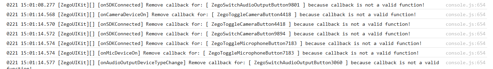

# Errors

First I get error in zegocloud_zego-uikit-prebuilt-call-rn:generateCodegenSchemaFromJavaScript




I can get through this by patching `\@react-native\codegen\lib\cli\combine\combine-js-to-schema.js`

I then get an error related to `ZegoExpressNativeModule.prefix` being null, which I can patched again.


The app compiles but is unusable. I get this error.




Info from `@react-native-community/cli info`

```bash
System:
  OS: Windows 11 10.0.26100
  CPU: (12) x64 11th Gen Intel(R) Core(TM) i5-11400 @ 2.60GHz
  Memory: 2.66 GB / 15.88 GB
Binaries:
  Node:
    version: 18.20.6
    path: ~\AppData\Roaming\nvm\current\node.EXE
  Yarn:
    version: 1.22.22
    path: ~\AppData\Roaming\nvm\current\yarn.CMD
  npm:
    version: 10.8.2
    path: ~\AppData\Roaming\nvm\current\npm.CMD
  Watchman:
    version: 20250126.093517.0
    path: C:\ProgramData\chocolatey\bin\watchman.EXE
SDKs:
  Android SDK: Not Found
  Windows SDK: Not Found
IDEs:
  Android Studio: AI-242.23726.103.2422.12816248
  Visual Studio: Not Found
Languages:
  Java: 17.0.12
  Ruby: Not Found
npmPackages:
  "@react-native-community/cli":
    installed: 15.0.1
    wanted: 15.0.1
  react:
    installed: 18.3.1
    wanted: 18.3.1
  react-native:
    installed: 0.77.0
    wanted: 0.77.0
  react-native-windows: Not Found
npmGlobalPackages:
  "*react-native*": Not Found
Android:
  hermesEnabled: true
  newArchEnabled: true
iOS:
  hermesEnabled: Not found
  newArchEnabled: Not found
```
